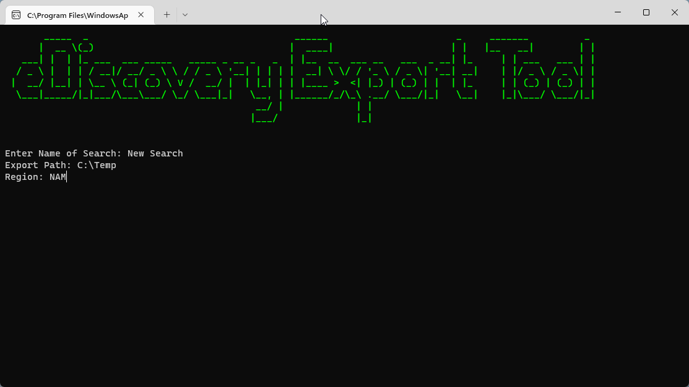
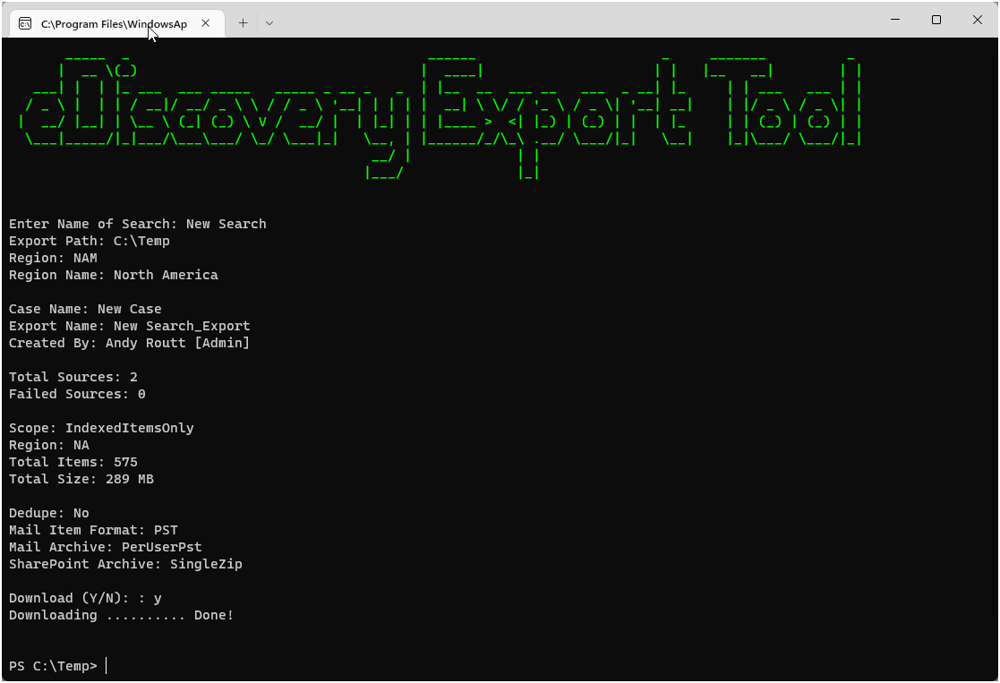
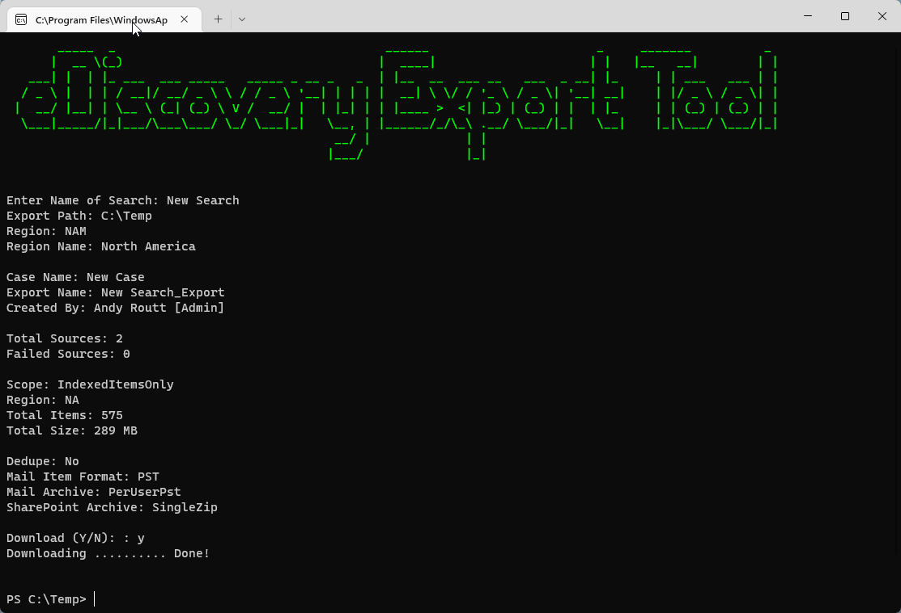

# eDiscovery-Export-Tool

Powershell script to create and download eDiscovery searches from Purview Compliance Portal. Supports assigning export jobs by region and downloading via the command line.

### Prerequisites

- eDiscovery Export Tool
- ExchangeOnlineManagement Module
- Figlet Module

### Setup

1. Install the [Microsoft eDiscovery Export Tool](https://complianceclientsdf.blob.core.windows.net/v16/Microsoft.Office.Client.Discovery.UnifiedExportTool.application)


### Usage

```
PS> eDiscovery-Export-Tool.ps1
```





### Disclaimer

These are proof of concept scripts. Use at your own risk.
