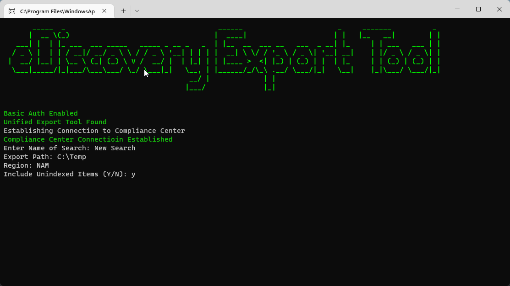
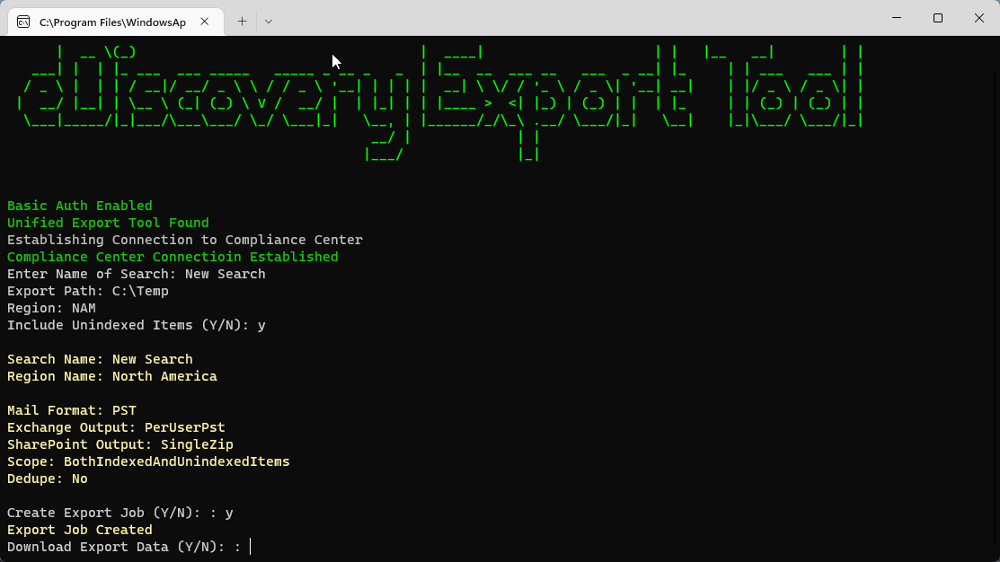
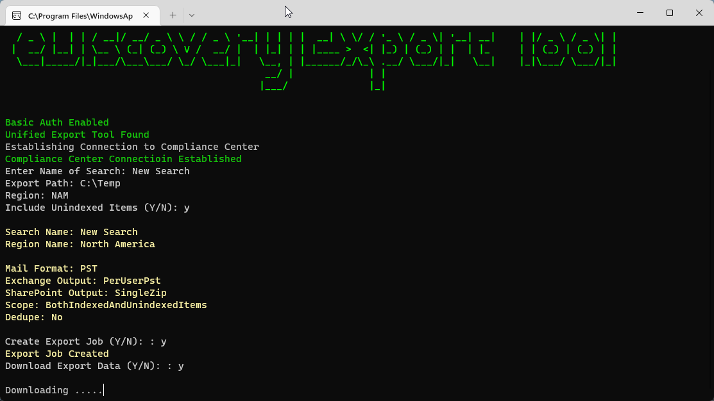
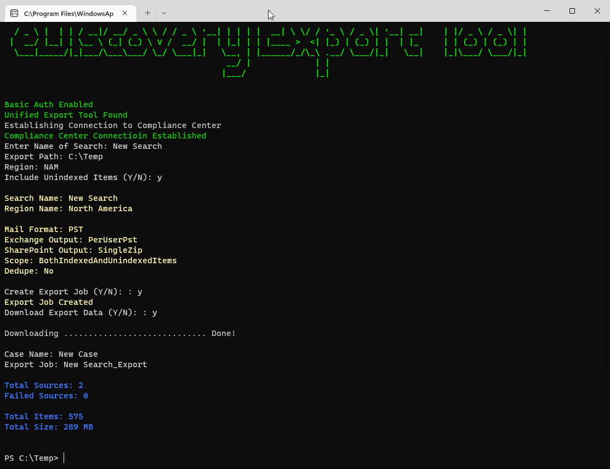

# eDiscovery-Export-Tool

Powershell script to create and download eDiscovery searches from the Microsoft Purview Compliance Portal. Supports assigning export jobs by region and downloading via the command line.

### Prerequisites

- [Microsoft eDiscovery Export Tool](https://complianceclientsdf.blob.core.windows.net/v16/Microsoft.Office.Client.Discovery.UnifiedExportTool.application)
- [ExchangeOnlineManagement Module](https://www.powershellgallery.com/packages/ExchangeOnlineManagement/)
- [Figlet Module](https://www.powershellgallery.com/packages/Figlet/)
- Existing eDiscovery Search

### Usage

1. Install Prerequisite Modules

	```
	PS> Install-Module ExchangeOnlineManagement -Force -ErrorAction Stop -Scope CurrentUser
	PS> Install-Module Figlet -AllowClobber -Force -ErrorAction Stop -Scope CurrentUser
	```

2. Create a new eDiscovery search within Purview Compliance Center

	- [Search for content in a eDiscovery (Standard) case](https://learn.microsoft.com/en-us/microsoft-365/compliance/ediscovery-search-for-content?source=recommendations&view=o365-worldwide)
	<p>

3. Launch eDiscovery-Export-Tool

	```
	PS> .\eDiscovery-Export-Tool.ps1
	```

4. Authenticate to Compliance Center and fill in job details

	- Search Name
	- Export Path
	- Region
	- Include Unindexed Items

	[Supported Regions](https://learn.microsoft.com/en-us/powershell/module/exchange/set-compliancesecurityfilter?view=exchange-ps#-region)

	| Name |            Region           |
	|------|-----------------------------|
	| APC  | Asia-Pacific                |
	| AUS  | Australia                   |
	| CAN  | Canada                      |
	| EUR  | Europe, Middle East, Africa |
	| FRA  | France                      |
	| GBR  | United Kingdon              |
	| IND  | India                       |
	| JPN  | Japan                       |
	| LAM  | Latin America               |
	| NAM  | North America               |
	<p>

	

5. Accept prompt to create export job

	

6. Accept prompt to download data to local computer

	

7. Review export details

	

### Disclaimer

This is a proof of concept script meant for testing purposes only. Use at your own risk.
